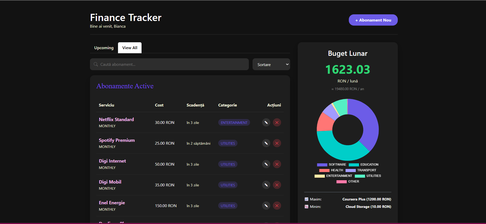
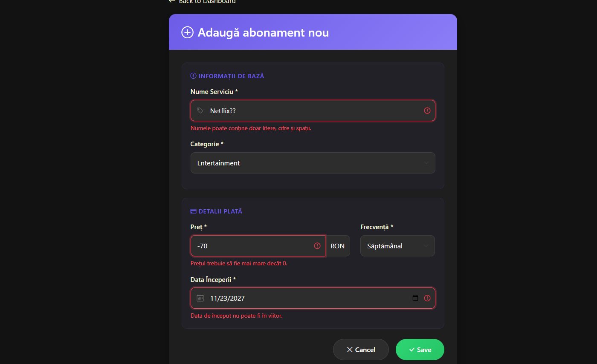

# Subscription Tracker

O aplicatie web moderna pentru gestionarea abonamentelor personale, dezvoltata in Java cu Spring Boot.



## Functionalitati

- CRUD complet - Adauga, vizualizeaza, editeaza si sterge abonamente
- Calcul automat - Costuri lunare si anuale calculate automat
- Grafic interactiv - Vizualizare cheltuieli pe categorii (Doughnut Chart)
- Filtrare si sortare - Cauta dupa nume/categorie, sorteaza dupa pret/data
- Validari - Verificare date server-side cu mesaje in romana
- Verificare duplicat - Previne adaugarea aceluiasi abonament de doua ori
- REST API - 14 endpoint-uri pentru integrari externe
- Design modern - Interfata Dark Mode responsiva

## Tehnologii utilizate

| Categorie | Tehnologii |
|-----------|------------|
| Backend | Java 17, Spring Boot 3.2, Spring MVC, Spring Data JPA |
| Frontend | Thymeleaf, HTML5, CSS3, JavaScript, Chart.js |
| Baza de date | H2 Database (embedded) |
| Build | Maven |
| IDE | IntelliJ IDEA |
| Testare API | Postman |

## Structura proiectului
```
src/main/java/com/awj/proiect/subscription_tracker/
├── controller/
│   ├── SubscriptionController.java
│   └── SubscriptionWebController.java
├── model/
│   ├── Subscription.java
│   ├── Category.java
│   └── BillingCycle.java
├── repository/
│   └── SubscriptionRepository.java
├── service/
│   └── SubscriptionService.java
└── SubscriptionTrackerApplication.java
```

## Cum rulezi aplicatia

### Cerinte:
- Java 17+
- Maven

### Pasi:

1. Cloneaza repository-ul:
```bash
git clone https://github.com/nedelcubianca/Subscription-Tracker.git
cd Subscription-Tracker
```

2. Ruleaza aplicatia:
```bash
mvn spring-boot:run
```

3. Deschide in browser:
```
http://localhost:8081
```

## Screenshots

### Dashboard
Pagina principala cu lista abonamentelor si statistici.


### Formular adaugare/editare
Formular cu validari pentru gestionarea abonamentelor.


### Validari
Mesaje de eroare in limba romana pentru date invalide.



## REST API Endpoints

| Metoda | Endpoint | Descriere |
|--------|----------|-----------|
| GET | /api/subscriptions | Lista toate abonamentele |
| GET | /api/subscriptions/{id} | Obtine un abonament |
| POST | /api/subscriptions | Creeaza abonament nou |
| PUT | /api/subscriptions/{id} | Actualizeaza abonament |
| DELETE | /api/subscriptions/{id} | Sterge abonament |
| GET | /api/subscriptions/stats/total-monthly | Cost lunar total |
| GET | /api/subscriptions/stats/total-yearly | Cost anual total |
| GET | /api/subscriptions/stats/by-category | Costuri pe categorii |
| GET | /api/subscriptions/stats/most-expensive | Cel mai scump |
| GET | /api/subscriptions/stats/cheapest | Cel mai ieftin |

## Categorii disponibile

- ENTERTAINMENT - Netflix, Spotify, HBO
- UTILITIES - Internet, Telefonie
- EDUCATION - Cursuri online, Duolingo
- HEALTH - Sala, Abonamente medicale
- SOFTWARE - Microsoft 365, Adobe
- TRANSPORT - Metrou, STB
- OTHER - Altele

## Autor

Nedelcu Bianca-Nicoleta

Universitatea POLITEHNICA din Bucuresti
Facultatea de Automatica si Calculatoare

Proiect realizat pentru disciplina Aplicatii Web cu suport Java - 2025
