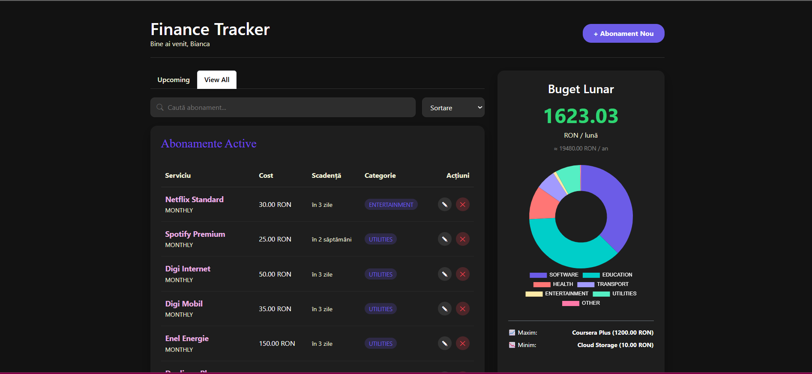

# Subscription Tracker

A modern web application for managing personal subscriptions, developed in Java with Spring Boot.



## Features

- **Full CRUD Operations** - Add, view, edit, and delete subscriptions.
- **Automated Calculations** - Automatically calculates total monthly and yearly costs.
- **Interactive Chart** - Visualizes expenses by category using a Doughnut Chart.
- **Filtering & Sorting** - Search by name/category and sort by price or date.
- **Data Validation** - Server-side validation with localized error messages (Romanian).
- **Duplicate Prevention** - Prevents adding the same subscription twice.
- **REST API** - Exposes 14 endpoints for external integrations.
- **Modern Design** - Fully responsive UI with a Dark Mode theme.

## Tech Stack

| Category | Technologies |
|-----------|------------|
| **Backend** | Java 17, Spring Boot 3.2, Spring MVC, Spring Data JPA |
| **Frontend** | Thymeleaf, HTML5, CSS3, JavaScript, Chart.js |
| **Database** | H2 Database (embedded) |
| **Build Tool** | Maven |
| **IDE** | IntelliJ IDEA |
| **API Testing** | Postman |

## Project Structure
```text
src/main/java/com/awj/proiect/subscription_tracker/
├── controller/
│   ├── SubscriptionController.java
│   └── SubscriptionWebController.java
├── model/
│   ├── Subscription.java
│   ├── Category.java
│   └── BillingCycle.java
├── repository/
│   └── SubscriptionRepository.java
├── service/
│   └── SubscriptionService.java
└── SubscriptionTrackerApplication.java
